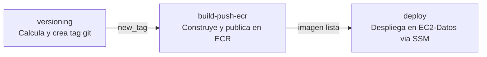

# ep03-db

Imagen Docker de PostgreSQL 16 para la capa de datos del sistema **Alumnos**. Incluye inicialización automática del esquema y datos de ejemplo listos para desarrollo.

---

## Contenido

```
ep03-db/
├── Dockerfile          # Imagen basada en postgres:16-alpine
├── docker-compose.yml  # Orquestacion local con persistencia
├── init.sql            # Esquema y datos de ejemplo (auto-ejecutado)
├── pgdata/             # Directorio de datos persistentes (bind mount)
│   ├── data/           # Datos reales de PostgreSQL (en .gitignore)
│   └── .gitkeep
└── .gitignore          # Excluye pgdata/data/ del repositorio
```

---

## Requisitos

| Herramienta    | Version minima |
| -------------- | -------------- |
| Docker         | 20.10+         |
| Docker Compose | 2.0+           |

---

## Inicio rapido

### 1. Construir y levantar

```bash
docker compose up -d --build
```

### 2. Verificar que esta corriendo

```bash
docker compose ps
```

Esperar que el estado sea `healthy`:

```
NAME            STATUS                   PORTS
ep03-db   Up X seconds (healthy)   0.0.0.0:5432->5432/tcp
```

### 3. Conectarse a la base de datos

```bash
docker exec -it ep03-db psql -U ep03_user -d ep03
```

### 4. Detener el contenedor

```bash
docker compose down
```

> Los datos persisten en `./pgdata/` y se recuperan al volver a levantar el contenedor.

---

## Configuracion

### Variables de entorno

| Variable            | Valor por defecto | Descripcion              |
| ------------------- | ----------------- | ------------------------ |
| `POSTGRES_DB`       | `ep03`         | Nombre de la base de datos |
| `POSTGRES_USER`     | `ep03_user`    | Usuario de conexion      |
| `POSTGRES_PASSWORD` | `ep03_pass`    | Contrasena del usuario   |

Para sobreescribir los valores, edita la seccion `environment` en `docker-compose.yml` o usa un archivo `.env`:

```env
POSTGRES_DB=ep03
POSTGRES_USER=ep03_user
POSTGRES_PASSWORD=ep03_pass
```

### Puertos

| Puerto host | Puerto contenedor | Protocolo |
| ----------- | ----------------- | --------- |
| 5432        | 5432              | TCP       |

---

## Persistencia de datos

Los datos se almacenan en el directorio local `./pgdata/` mediante un **bind mount**. Esto garantiza que la informacion sobrevive a:

- `docker compose down` y `docker compose up`
- Reinicios del sistema
- Rebuilds de la imagen

```
ep03-db/
└── pgdata/
    └── data/        ← datos de PostgreSQL en tu maquina local
        ├── base/
        ├── global/
        └── ...
```

> `pgdata/` esta en `.gitignore` para evitar subir datos al repositorio. El archivo `.gitkeep` mantiene el directorio en el repo.

### Resetear la base de datos

Para borrar todos los datos y ejecutar `init.sql` desde cero:

```bash
docker compose down
rm -rf ./pgdata/data/*
docker compose up -d --build
```

---

## Esquema de la base de datos

Definido en `init.sql`, se ejecuta automaticamente en el primer arranque cuando `pgdata/` esta vacio.

### Tabla `ep03`

```sql
CREATE TABLE IF NOT EXISTS ep03 (
    id        BIGSERIAL    PRIMARY KEY,
    nombre    VARCHAR(100) NOT NULL,
    apellido  VARCHAR(100) NOT NULL
);
```

| Columna   | Tipo          | Restriccion  | Descripcion          |
| --------- | ------------- | ------------ | -------------------- |
| `id`      | BIGSERIAL     | PRIMARY KEY  | Identificador unico  |
| `nombre`  | VARCHAR(100)  | NOT NULL     | Nombre del alumno    |
| `apellido`| VARCHAR(100)  | NOT NULL     | Apellido del alumno  |

### Datos de ejemplo

El script inserta 8 registros iniciales para desarrollo:

| nombre    | apellido  |
| --------- | --------- |
| Juan      | Perez     |
| Ana       | Lopez     |
| Carlos    | Soto      |
| Maria     | Gonzalez  |
| Pedro     | Ramirez   |
| Sofia     | Munoz     |
| Diego     | Torres    |
| Valentina | Flores    |

---

## Comandos utiles

### Consultar datos

```bash
docker exec -it ep03-db psql -U ep03_user -d ep03 -c "SELECT * FROM ep03;"
```

### Ver logs del contenedor

```bash
docker compose logs -f ep03-db
```

### Verificar healthcheck

```bash
docker inspect --format='{{.State.Health.Status}}' ep03-db
```

### Backup de la base de datos

```bash
docker exec ep03-db pg_dump -U ep03_user ep03 > backup.sql
```

### Restaurar un backup

```bash
docker exec -i ep03-db psql -U ep03_user -d ep03 < backup.sql
```

---

## Imagen Docker

| Propiedad   | Valor                  |
| ----------- | ---------------------- |
| Base image  | `postgres:16-alpine`   |
| Imagen ECR  | `ep03-db:latest` |
| Puerto      | `5432`                 |
| Healthcheck | `pg_isready`           |

### Construir la imagen manualmente

```bash
docker build -t ep03-db:latest .
```

### Publicar en ECR

```bash
# Autenticarse en ECR
aws ecr get-login-password --region us-east-1 \
  | docker login --username AWS --password-stdin <ECR_REGISTRY>

# Tag y push
docker tag ep03-db:latest <ECR_REGISTRY>/ep03-db:latest
docker push <ECR_REGISTRY>/ep03-db:latest
```

---

## Contexto en la arquitectura

Esta imagen forma parte de la infraestructura de 3 capas del sistema Alumnos:

```
Internet
   |
EC2-Web  (ep03-frontend:latest)    — Capa Web    — Puerto 80
   |
EC2-App  (ep03-backend:latest)    — Capa App    — Puerto 8080
   |
EC2-Datos (ep03-db:latest) — Capa Datos  — Puerto 5432  <-- este servicio
```

- Solo accesible desde la capa App (SG-Datos permite TCP 5432 unicamente desde SG-App)
- Desplegada en `Subnet-Datos` sin acceso a internet
- Acceso a ECR y SSM por VPC Endpoints privados

---

## Notas de seguridad

- Las credenciales por defecto son solo para desarrollo local. En produccion usar AWS Secrets Manager o variables de entorno inyectadas en el pipeline.
- En el despliegue AWS, las credenciales se pasan como variables de entorno al contenedor desde el script `deploy-datos.sh` via SSM.
- El puerto 5432 no debe exponerse publicamente en ningun entorno.

---

## CI/CD — GitHub Actions

El pipeline esta definido en `.github/workflows/ci.yml` y se ejecuta automaticamente en cada `push` a cualquier rama. Orquesta tres jobs secuenciales que cubren el ciclo completo: versionado semantico, publicacion en ECR y despliegue en AWS.

### Trigger

```
push → cualquier rama (**)
```

### Flujo del pipeline



### Job 1 — Versioning

Calcula automaticamente la siguiente version semantica con esquema `v1.x.0` y crea el tag en el repositorio.

**Logica de calculo:**
- Busca el ultimo tag existente con patron `v1.*`
- Si no existe ningun tag, inicia en `v1.0.0`
- Si existe, incrementa el numero menor: `v1.3.0` → `v1.4.0`
- Crea y publica el tag en el repositorio con `github-actions[bot]`

**Output:** `new_tag` — utilizado por los jobs siguientes como identificador de version.

---

### Job 2 — Build & Push ECR

Construye la imagen Docker desde el `Dockerfile` e `init.sql`, y la publica en Amazon ECR con dos tags simultaneos.

**Pasos:**
1. Configura credenciales AWS desde los secrets del repositorio
2. Autentica en Amazon ECR
3. Construye la imagen con Docker Buildx (soporte multi-plataforma y cache)
4. Publica con dos tags:
   - `v1.x.0` — version inmutable para trazabilidad
   - `latest` — apuntando siempre a la version mas reciente

**Cache:** utiliza GitHub Actions Cache (`type=gha`) para reutilizar capas entre ejecuciones y reducir el tiempo de build.

| Tag publicado | Ejemplo | Uso |
|---|---|---|
| Version semantica | `ep03-db:v1.4.0` | Rollback, trazabilidad |
| Latest | `ep03-db:latest` | Despliegue automatico |

---

### Job 3 — Deploy via SSM

Despliega la nueva imagen en la instancia `EC2-Datos` sin necesidad de acceso SSH directo. La instancia esta en una subnet privada sin acceso a internet — la comunicacion se realiza exclusivamente a traves de **VPC Endpoints de SSM**.

**Pasos:**
1. Obtiene el Instance ID de `EC2-Datos` desde **SSM Parameter Store** (`/ep03/ec2/datos`)
2. Envia el comando `deploy-datos.sh` a la instancia via `AWS-RunShellScript`
3. Hace polling del estado del comando cada 10 segundos (maximo 5 minutos / 30 intentos)
4. Si el comando termina en `Success`, imprime el output y el job finaliza exitosamente
5. Si termina en `Failed`, `TimedOut` o `Cancelled`, imprime el error y el job falla

**Comportamiento del deploy en EC2-Datos:**
- Detiene y elimina el contenedor anterior
- Hace pull de `ep03-db:latest` desde ECR via VPC Endpoint
- Recrea el contenedor — los datos se reinician desde `init.sql`

> El reinicio de datos en cada deploy es intencional para este entorno de laboratorio. En produccion se omite el `rm -rf pgdata` para preservar los datos existentes.

---

### Secrets requeridos

| Secret | Descripcion |
| ------ | ----------- |
| `AWS_ACCESS_KEY_ID` | Credencial de acceso AWS |
| `AWS_SECRET_ACCESS_KEY` | Clave secreta AWS |
| `AWS_SESSION_TOKEN` | Token de sesion AWS (Lab Academy) |
| `AWS_REGION` | Region AWS (`us-east-1`) |

### Resumen de ejecucion

Al finalizar cada job, el pipeline publica un resumen en la interfaz de GitHub Actions con la version desplegada, el ID de la instancia y el estado del contenedor.

### Permisos

| Permiso | Nivel | Razon |
| ------- | ----- | ----- |
| `contents: write` | Repositorio | Crear y publicar tags git |
